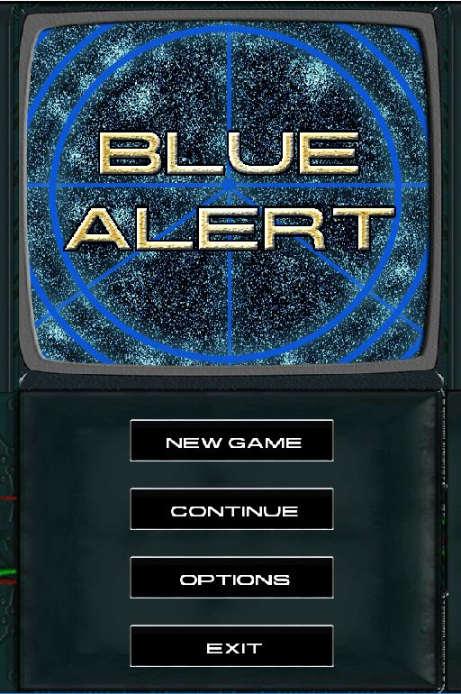
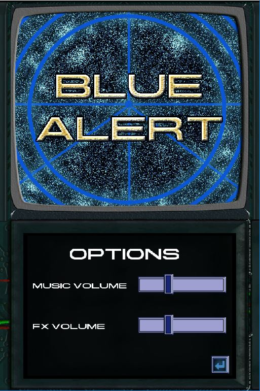
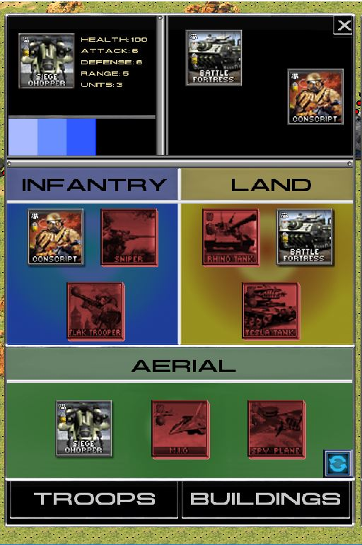

# Eric Navarro
## Individual Contribution

## Wiki Contribution

- UI Document

I was in charge of incorporating the UI modules made in the Development subject, adapting it to the Project II subject.
It was a tangled charge cause the code made in Development subject was quite different than the code that we were making in the Project II subject, I had a few problems implementing it but at the end it was a job of focusing in both codes.
After doing that my individual contributions have been:
## Main Menu
I made the Main Menu scene, where you can see 4 buttons.
The first one is to start a new game, this one will leave you in the tutorial.
The second one, the continue button, is going to leave you were you left it the last time you played.
The third one, the options button, contains some adjustments for the game, you are going to see it right after this section.
The last one, the exit button, makes an obvious behaviour, close the game.
 

## Options Menu

I made the Options Menu scene.
In this scene, there is two simple sliders, the first one serves to adjust the music volume, the second one serves to adjust the FX volume.
The logic of the sliders was made big part by another team member, Alex Morales, and a small part by me.
The small part was to sync the movement of the slider with the volume and the FX of the game.

## Troops Menu

The Troops Menu was a task for few of the members of the team.
Especially, my task was to put the images corresponding to the image below, were you can see all the troops that you can use, exchange them and see some information of the buildings of the game. Part of my work was also to make part of the logic for the exchange of troops and to make sure it was synchronized visually and internally.

