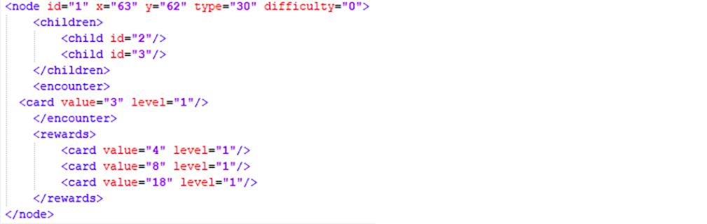
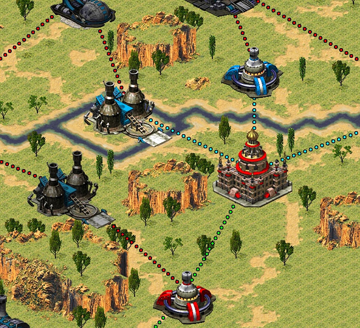

# Marc Guillén
## Individual Contribution

### Code

 - **EncounterNode class**: In blue alert the player progress by defeating a map of encounters which contains the type of building the encounter is, the difficulty of the encounter, the deck the enemy AI will have and the rewards the player will obtain by defeating the encounter.  This values can be edited by the designer by changing the values of an xml.

- **EncounterTree class**: it's a factory of EncounterNodes that creates, destroy and it's able to draw a path between them in three different colors blue meaning the available ways to continue progressing, red meaning unaccessible paths and green meaning conquered paths.

- **StrategyMap Scene drag movement**: in this scene the player must be able to navigate through it and see the incoming encounter nodes to choose a path and a strategy. So I developed a simple drag movement.

- **Transition Manager**: during this project I did a research about transitions and developed a transition manager that includes multiple ways of transitioning such as fades, dissolves, wipes and camera translations. You can check the research repository [here](https://marcgs96.github.io/Camera-Transitions-Research/). 

### UI

- **Troop Deploy UI**: With the help of Alex Morales and Laia Martinez we designed and developed the troop deploying UI in the combat scene, this UI is able to show the player cards, the current energy available the cost of each cards and an internal cooldown for each troop depending of their cost and the current energy.

- **Store**: Whit the help of Laia Martinez we designed and developed the Store Menu, a section were the player can spend his gold by buying new troops or upgrading his owned troops.

### Art

**3D model conversion to 2D spritesheets**: Some of the assets provided by the game Comand and Conquer: Red Alert 2 were 3D models, so I took this models and created a 2D spritesheet from them by creating an animation in 3DsMax and then packaging every sprite with TexturePacker.

### Others

- **Wiki home page**: created the wiki Home page. Check it here.
- **Wiki original game page**: created the wiki Original game page. Check it here.
- **Bug solving**: participed in multiple bug solving of the game.
- **Alpha and Gold assignement presentation**: participed in the presentation of the Alpha and Gold were me and Alejandro París explained the game and the marketing plan behind the project.

### Lead

As a lead I tried to keep the team united and focused in the project scope, also designed the monetization and the marketing plan of the project. I also organized and directed multiple meetings with the team and stayed communicated with other project leads.
